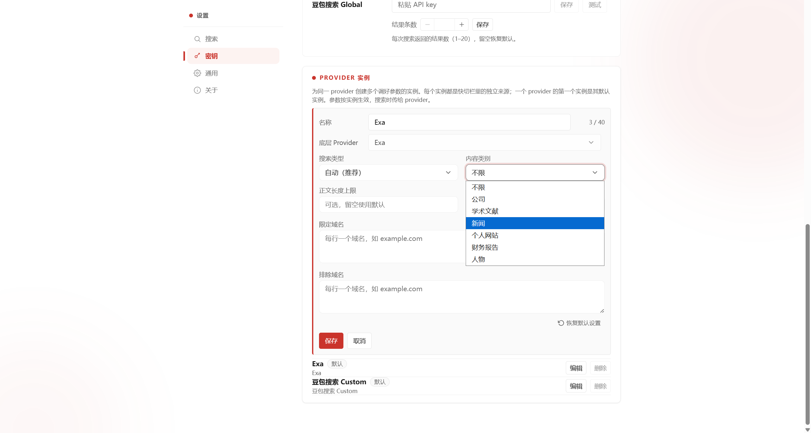
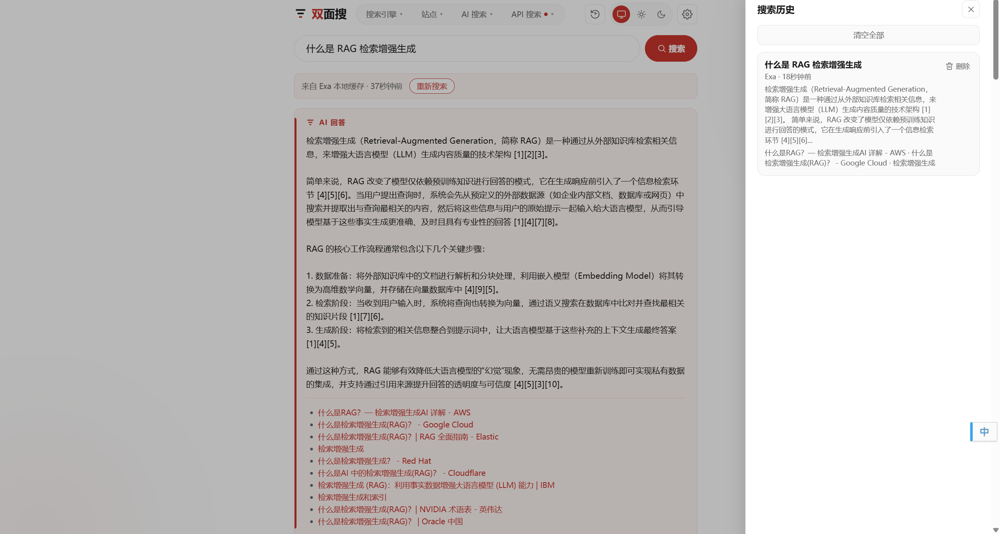
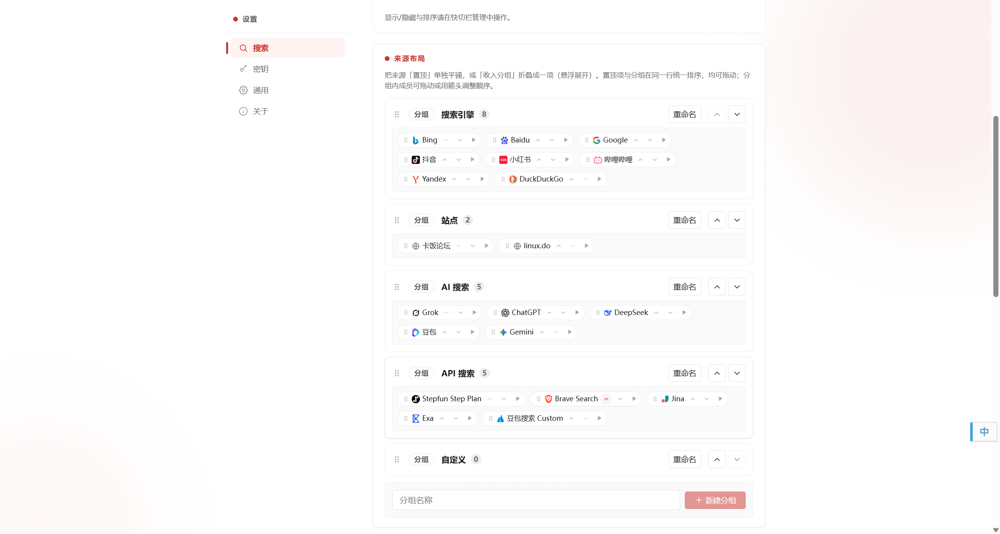
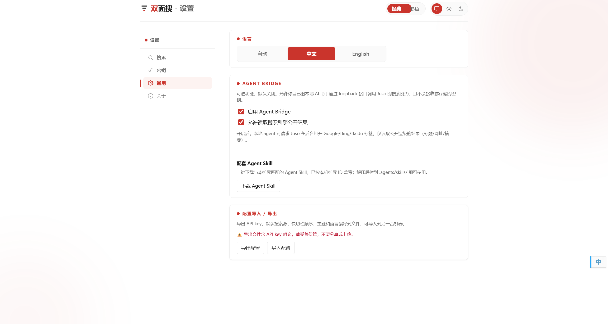

# Juso

[](LICENSE)
[](https://github.com/aiguozhi123456/juso-search/releases/latest)
[](https://chromewebstore.google.com/detail/%E5%8F%8C%E9%9D%A2%E6%90%9C/illmhdnglkjfcenboepdgopaeejdgoji)
[](https://aiguozhi123456.github.io/juso-search/)
[](https://developer.chrome.com/docs/extensions/develop/migrate)
[](https://wxt.dev)
[](https://github.com/aiguozhi123456/juso-search/pulls)

[简体中文](README.md) | **English**

> **Search with equal focus on people and agents.**

Juso is an open-source, two-sided search product. It gives people one place to select and switch between conventional search engines, saved site-scoped searches (Site Engines), custom engines, AI chat engines, and configured AI search services. It also lets local AI agents use AI search APIs through the same browser or search conventional engines. The extension manages credentials locally, while requests go directly to the service you select. Even using only the human side, it is a fully functional, ready-to-use search aggregation and switching tool — Google, Bing, Baidu, Douyin, Xiaohongshu, Bilibili, Yandex, and DuckDuckGo work with zero AI service configuration, and you can save site-scoped searches or any URL-template-based custom engines in settings, and use AI chat sites as switchable search engines, all without any API key.

| For | What it does today |
| --- | --- |
| People | Aggregates conventional engines, saved site-scoped searches, and custom engines with fast switching on the Juso page and result pages |
| People | Turns AI search APIs into a search experience that can fast-switch with conventional engines (multi-instance support) |
| People | Uses AI chat sites as search engines, auto-filling the query with optional auto-submit |
| Local AI agents | Provides one access path to configured AI search APIs (including per-instance search) |
| Local AI agents | Searches conventional engines through a real browser |

## Screenshots and Demo

**AI search: synthesized answer and results side by side**


**SERP Switch Bar: switch engines from any result page**


**Instances: multiple tuned presets per AI service, first-class in the switch bar**



**Local cache & history: successful AI searches are viewable and replayable**



**Source management: all five source types in one place**



**Agent Bridge: the search entry for local agents**



**Full flow demo**


## Current Capabilities and Sources

Juso presents a **Search Source** as one user-facing choice. A source can be a conventional **Search Engine**, a user-saved **Site Engine**, a user-defined **Custom Engine**, a configured AI search service (which can have multiple tuned **instances**), or a preset **AI Chat Engine**; those five types use different execution paths.

- Conventional Search Engines: Google, Bing, Baidu, Douyin, Xiaohongshu, Bilibili, Yandex, and DuckDuckGo. They use no API key; Juso navigates a browser for people to use directly; all eight engines also let agents extract ordinary search results (Bilibili, Xiaohongshu, and Douyin extraction runs in a logged-in browser profile).
- Site Engines: save multiple site-scoped searches in extension settings. Each entry fixes Google, Bing, or Baidu as the underlying engine and searches that site with a `site:` operator. Targets must be public hostnames; the underlying engine is chosen at create time and does not change afterward. Saved entries appear on the search page and the SERP Switch Bar like other sources. No API key required.
- Custom Engines: save any URL containing a `%s` placeholder in extension settings, and it becomes a search engine on the search page and SERP Switch Bar. Unlike Site Engines, a Custom Engine navigates directly to a user-specified URL with no underlying engine. No API key required.
- AI search services: Tavily, Exa, Brave, Stepfun pay-as-you-go API, Stepfun Step Plan, Jina, and Doubao (Custom and Global endpoints). They are accessed through a normalized adapter interface, while each service retains its own authentication and billing. Services that support instances (currently Exa and Doubao Custom) can save multiple tuned variants (e.g. different search scenarios or filter directions); each instance is a first-class switchable target in the quick-switch bar. Instances hold no credentials — keys remain shared per service type.
- AI Chat Engines: Grok, ChatGPT, DeepSeek, Doubao, and Gemini. They turn AI chat sites into search engines: switching to one auto-fills the query, with optional auto-submit. These sources are hidden by default (login required) and appear in the quick-switch bar after you show them in settings. No API key required.
- Answer capability: Tavily and Exa can return a synthesized answer with a result list. Stepfun (including Step Plan), Brave, Jina, and Doubao currently return result lists only. AI Chat Engines are conversational interfaces and are not included here.

In the current release, “aggregation” means unified access, selection, and fast source switching. It does **not** mean a query retrieves from several sources in parallel by default, nor that results are merged, deduplicated, or fused by default.

## For People

The independent search page lets you choose and switch Search Sources, including saved Site Engines and Custom Engines. On supported Google, Bing, Baidu, Douyin, Xiaohongshu, Bilibili, Yandex, and DuckDuckGo result pages, the SERP Switch Bar can move the current query to another search source, or hand it off to Juso’s AI search page.

Successful AI searches are cached on the current device and appear in local search history that can be reviewed and replayed. Cache entries are scoped to a service plus normalized query, and are not shared across services. Use explicit refresh when you need fresh results; it bypasses the cache and may incur charges from the selected AI service.

## Quick Start

Juso v1.4.0 is available on GitHub Release and the Chrome Web Store.

### Install the extension

**From Chrome Web Store (recommended)**

1. Visit [Juso on the Chrome Web Store](https://chromewebstore.google.com/detail/%E5%8F%8C%E9%9D%A2%E6%90%9C/illmhdnglkjfcenboepdgopaeejdgoji).
2. Click **Add to Chrome** to install and enable the extension.

Chrome Web Store installation has no developer-mode warnings and supports automatic updates.

**From GitHub Release (v1.4.0)**

1. Download `juso-search-1.4.0-chrome-dev.zip` from the [GitHub Release v1.4.0](https://github.com/aiguozhi123456/juso-search/releases/tag/v1.4.0).
2. Extract the ZIP.
3. Open `chrome://extensions` in Chromium, enable Developer mode, choose **Load unpacked**, and select the extracted directory that directly contains `manifest.json`.

**From source**

See the [development document](docs/DEVELOPMENT.en.md) for development commands, build differences, and architecture.

### People

1. Open the Juso search page and choose a Search Source. Google, Bing, Baidu, Douyin, Xiaohongshu, Bilibili, Yandex, and DuckDuckGo need no configuration (engines hidden by default can be shown from settings). AI Chat Engines likewise need no API key (hidden by default, login required). To add site-scoped search, create Site Engines in extension settings (site + underlying engine). You can also add Custom Engines (any URL with a `%s` placeholder). Configure the corresponding key only when using an AI search service.

You can now search and switch among conventional engines, Site Engines, Custom Engines, AI Chat Engines, and configured AI search services from one entry point.

### Local AI Agents

1. Install and enable the extension in the **Chromium-family browser that will run Agent calls** (Chrome, Edge, Chromium, etc.). `engine-search` needs no AI search service configuration; configure the corresponding service only when calling an AI search API through `search --provider`.
2. Open Options → General → Agent Bridge and turn on the Agent Bridge master switch (off by default; must be enabled explicitly). To use `engine-search` for conventional engines, also enable its sub-switch.
3. On the same page, click **Download companion Agent Skill** — the skill is auto-stamped with this machine's extension ID; unzip it into `.agents/skills/`.
4. Run commands from the skill directory, for example:

```bash
python scripts/juso_search.py list-providers
python scripts/juso_search.py search "latest AI research" --provider tavily
python scripts/juso_search.py engine-search "latest AI research" --engine google --max-results 10
# Services that support instances (Exa, Doubao) can be searched per instance:
python scripts/juso_search.py list-instances
python scripts/juso_search.py search-instance "latest AI research" --instance-id inst:exa:abc123
```

The local agent can now list configured services, perform API searches with an **explicit** provider, search instance-supporting services per instance, or search any supported conventional engine (Google, Bing, Baidu, Yandex, DuckDuckGo, Bilibili, Xiaohongshu, Douyin) through the browser—without receiving stored credentials. Edge-case settings such as browser path, profile, extension ID, and timeout are documented in the skill's reference files.

The companion Agent Skill from step 3 and the MCP server are **alternatives — use one or the other**. If you use an MCP-native client (Claude Desktop, Cursor, Cline, Claude Code), use the MCP server instead: `pip install juso-search`, register `juso-search` in that client's `mcp.json` (set `JUSO_EXTENSION_ID` in `env`), and enable Agent Bridge in the extension's Options. Full steps are in [`mcp-server/README.md`](mcp-server/README.md).

## Security and Data Boundaries

- The extension manages AI search-service credentials locally in `chrome.storage.local`; only the background service worker reads them. UI pages do not read stored keys, and local AI agents do not receive them.
- When authentication requires it, a credential is sent to the AI search service you select. Queries reach the selected AI service or conventional Search Engine.
- In its current local mode, Juso operates neither a request proxy nor telemetry. Browsers, networks, conventional search engines, and AI search services may still record requests; Juso cannot guarantee anonymity or control those third parties’ logging practices.
- Configuration export is user-initiated and includes unencrypted credentials and preferences. The export is sensitive and remains in your custody; Juso operates no configuration-backup or credential-sync service.

## Agent Interface and Limits

Agents invoke bounded extension-worker actions through the Agent Bridge: a short-lived, loopback-only capability channel, not a persistent local API. Every invocation uses a new local port, token, and request identity, and expires on completion or timeout.

The `juso-search` MCP server reuses the same Agent Bridge interface and limits: the same 5 actions (`list-providers`, `search`, `list-instances`, `search-instance`, `engine-search`), the same default-off gating, and credentials still never leave the extension. The interface and limits above apply equally to the CLI skill and the MCP server.

`search` requires `--provider`; it never silently follows the extension’s current provider. Services that support instances (Exa, Doubao) can be searched per instance with `search-instance --instance-id`; obtain instance ids from `list-instances`. `engine-search` extracts ordinary result links only and does not promise AI summaries, knowledge panels, or other page content. Once an agent has a URL, page retrieval belongs to its host’s own capability, such as `web_fetch`. Launch and bridge failures return structured `error.kind` values on stdout (for example `chrome_not_found`, `chrome_launch_failed`, `extension_did_not_claim`, `extension_did_not_complete`). Fix browser path, profile, extension id, and confirm Juso is enabled in the opened browser—do not retry by exposing keys. Engine searches also fail on challenges, consent pages, unsupported layouts, and no results. See `skills/juso-search/SKILL.md` for the full kind table.

## Development

See the [development document](docs/DEVELOPMENT.en.md) for source install, development commands, architecture, and testing guide.

## Possible Future

This is not a roadmap or a promise. Based on demand, interface availability, and service stability, Juso may adapt more AI search services and conventional search engines. It may also explore optional parallel retrieval from multiple sources, deduplication, ranking, and provenance-preserving result fusion. Any such capability should give users explicit control of cost, scope, and latency.

## Naming History

The project’s original Chinese name was 聚搜, with the English name Juso. As of 2026-07-23 (after the v1.0.0 release), the Chinese name changed to 双面搜 while the English name remains Juso; the brand is written 双面搜 / Juso.

Why: 双面搜 directly reflects the product’s two-sided positioning—one side for people, one for agents—and is more distinctive in Chinese. The English name Juso is kept because it is short, memorable, and owns its brand queries (for example, “Juso extension”).

Code identifiers (package name `juso-search`, `JUSO_*` environment variables, `--juso-*` CSS variables, and the `juso-search` agent skill) keep Juso and are unaffected by the Chinese name change.

## Acknowledgements

The approach of inserting the switch bar as the first child of the result container to inherit its width and simplify alignment, and the approach of injecting a CSS shim into the host page to make room for the bar, on Google / Bing / Baidu result pages, as well as the choice of injection anchors (`.head-contain` / `.search-input`) on the Bilibili result page, are informed by [searchEngineJump 搜索引擎快捷跳转](https://greasyfork.org/zh-CN/scripts/27752-searchenginejump) (authors: NLF, 锐经, [qxin i](https://github.com/qxinGitHub/searchEngineJump), MIT licensed). This extension's implementation is independently written and shares no code with the original script.

The AI chat engine injection layer (DeepSeek / ChatGPT / Gemini / Doubao)—its input-field location, fill, and submit approaches—drew on several community userscripts and public technical articles, notably: [给 AI 搜索网站添加 q 查询参数](https://greasyfork.org/zh-CN/scripts/550940) (smilingpoplar, MIT licensed, a general multi-site `?q=` implementation), [DeepSeek Prompt Automation](https://gist.github.com/orca131/7f4dd7f2ec377c09cdb8b0ad5cd10e68) (orca131), [AI 助手选择器](https://greasyfork.org/zh-CN/scripts/528300) (Gemini / Grok / ChatGPT / DeepSeek input selectors), [豆包自动发送助手](https://greasyfork.org/zh-CN/scripts/541111) (CathyElla, MIT licensed) and boommanpro's [豆包 URL 参数调用](https://boommanpro.cn/post/doubao-plugin) (the Doubao `execCommand` fill conclusion), plus records of ChatGPT's `?q=` prefill behavior ([OpenAI Help Center: ChatGPT Search](https://help.openai.com/en/articles/9237897-chatgpt-search) (official), [Tenable TRA-2025-22](https://www.tenable.com/security/research/tra-2025-22), [Zenn: どこでもワンステップでAI呼び出し](https://zenn.dev/finatext/articles/283442255930fe)). This extension's injectors are independently written and share no code with these sources; the selectors are DOM facts of each site, and the React controlled-component native value setter, `execCommand('insertText')`, contenteditable synchronization, and `PerformanceNavigationTiming` fallback used for filling/submitting are all standard Web API techniques.

## Trademark Notice

All third-party product names, brand names, service names, trademarks, and icons appearing in this extension (including but not limited to Google, Bing, Baidu, Douyin, Xiaohongshu, Bilibili, Yandex, DuckDuckGo, Tavily, Exa, Brave, Stepfun, Jina, Doubao, DeepSeek, ChatGPT, Gemini, Grok, etc.) are the property of their respective owners and are used solely to refer to the corresponding search sources and services. This extension is not affiliated with, sponsored by, or endorsed by these brand owners, nor is it an official product of theirs. Icons are used in accordance with each brand's public brand guidelines.

## License

Juso’s complete local search loop—the current extension, source integrations, agent access, local configuration, and cache—is open under [MPL-2.0](LICENSE). This commitment does not imply that possible future hosted or operational services will be open source or free.
