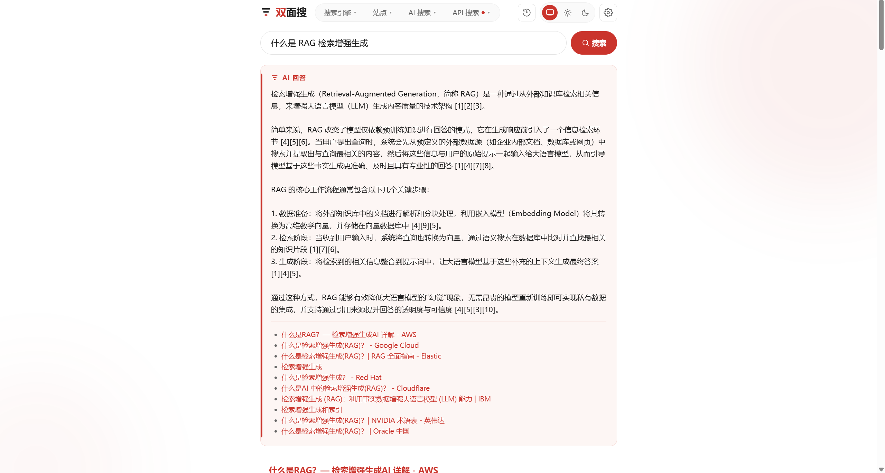
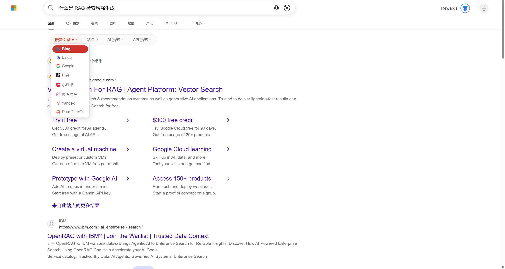

# 双面搜 / Juso

[](LICENSE)
[](https://github.com/aiguozhi123456/juso-search/releases/latest)
[](https://chromewebstore.google.com/detail/%E5%8F%8C%E9%9D%A2%E6%90%9C/illmhdnglkjfcenboepdgopaeejdgoji)
[](https://developer.chrome.com/docs/extensions/develop/migrate)
[](https://wxt.dev)
[](https://github.com/aiguozhi123456/juso-search/pulls)

[English](README.en.md)

> **一面为人，一面为智能体。**

Juso 是一个开源的双面搜索产品：它让人类用户在同一入口选择、切换传统搜索引擎、站外搜索（Site Engine）与已配置的 AI 搜索服务；也让本地 AI 智能体通过同一台浏览器调用 AI 搜索 API，或检索传统搜索引擎。密钥由扩展在本地管理，搜索请求直接前往你选择的服务。即使只使用人类这一面，它也是一个功能完整、开箱即用的搜索聚合与切换工具——无需配置任何 AI 服务即可使用 Google、Bing、Baidu、抖音、小红书和哔哩哔哩，也可在设置中保存面向指定站点的站外搜索。

| 面向谁 | 现在能做什么 |
| --- | --- |
| 人类用户 | 聚合传统搜索引擎与可保存的站外搜索，并在独立搜索页与结果页中快速切换 |
| 人类用户 | 把 AI 搜索 API 变成可直接使用、可与传统引擎快切的搜索体验 |
| 本地 AI 智能体 | 通过统一入口调用已配置的 AI 搜索 API |
| 本地 AI 智能体 | 借助真实浏览器检索传统搜索引擎 |

## 截图与演示

**AI 搜索：综合答案与结果列表同屏**



**SERP 切换栏：在搜索引擎结果页内一键切换**



**完整流程演示**


## 当前能力与来源

Juso 将**搜索来源**作为统一的用户选择：它可以是传统**搜索引擎**、用户保存的**站外搜索（Site Engine）**，或已配置的 AI 搜索服务；三者的执行方式不同。

- 传统搜索引擎：Google、Bing、Baidu、抖音、小红书、哔哩哔哩。它们不使用 API 密钥；Juso 通过浏览器导航，供人直接使用；其中 Google、Bing、Baidu 还支持智能体提取普通搜索结果。
- 站外搜索（Site Engine）：在扩展设置中保存多个站点；每个条目固定选用 Google、Bing 或 Baidu 之一，用 `site:` 限定到该站点后搜索。目标须为公网域名；底层引擎在创建时选定，之后不再更改。创建后会出现在搜索页与 SERP 切换栏，与其他来源一样可切换。无需 API 密钥。
- AI 搜索服务：Tavily、Exa、Stepfun 按量 API、Stepfun Step Plan。服务经由统一的适配器接口访问，但各自的鉴权与计费由相应服务决定。
- 答案能力：Tavily 和 Exa 可返回综合答案及结果列表；两个 Stepfun 来源当前仅返回结果列表。

“聚合”在当前版本中指统一接入、选择与快速切换搜索来源，**不表示**一次查询默认并行请求多个来源，也不表示默认合并、去重或融合结果。

## 人类使用

独立搜索页提供搜索来源选择和切换（含已保存的站外搜索）；在 Google、Bing、Baidu、抖音、小红书、哔哩哔哩的受支持结果页上，SERP 切换栏可将当前查询直接切到其他搜索引擎、站外搜索，或跳转至 Juso 的 AI 搜索页。

成功的 AI 搜索会缓存在当前设备上，并形成可查看、可重放的本地搜索历史。缓存按“服务 + 规范化查询”区分，不在服务之间共享。需要最新结果时，请显式刷新；刷新会绕过缓存，并可能产生所选 AI 服务的费用。

## 快速开始

Juso 已发布 v1.2.0，可从 Chrome Web Store 一键安装。先按“安装与更新”完成扩展安装，再按你的使用方式继续。

### 人类用户

1. 按"安装与更新"安装并启用扩展（推荐从 Chrome Web Store 安装）。
2. 打开 Juso 搜索页并选择搜索来源。Google、Bing、Baidu、抖音、小红书、哔哩哔哩无需配置（默认隐藏的可在设置页点「显示」启用）；若要站外搜索，在扩展设置中添加 Site Engine（站点 + 底层引擎）；只有使用 AI 搜索服务时，才需要配置对应服务的密钥。

完成后，你可以在一个入口搜索、切换传统引擎、已保存的站外搜索和已配置的 AI 搜索服务。

### 本地 AI 智能体

1. 按上面的步骤在 **装有 Juso 的 Chromium 系浏览器**（Chrome / Edge / Chromium 等）中安装并启用扩展。使用 `engine-search` 检索传统搜索引擎无需配置 AI 搜索服务；只有通过 `search --provider` 调用 AI 搜索 API 时，才需要先配置对应服务。
2. 根据你的 Juso 安装方式选择技能：
   - **Chrome Web Store 安装**（推荐）：将 `skills/juso-search/` 安装或复制到你的智能体技能目录，例如 `.agents/skills/juso-search/`。扩展 ID 已内置默认值，一般无需配置。
   - **开发版（自行 `npm run build:dev` 构建）**：将 `skills/juso-search-dev/` 安装或复制到你的智能体技能目录，例如 `.agents/skills/juso-search-dev/`。两个技能的唯一区别在于扩展 ID 不同，请按需选择。
3. 仅在自行签名打包（或扩展 ID 与默认不一致）时，才设置 `JUSO_EXTENSION_ID` 或传入 `--extension-id`。
4. 若自动发现找不到浏览器，或扩展装在 Edge 等非默认二进制上，请把可执行文件路径指到**已安装 Juso 的那一份浏览器**（可同时指定 profile 目录名）：

```powershell
$env:JUSO_CHROME_PATH = "C:\Program Files (x86)\Microsoft\Edge\Application\msedge.exe"
# 可选：$env:JUSO_CHROME_PROFILE = "Default"
# 可选：$env:JUSO_EXTENSION_ID = "你的扩展 ID"
```

```bash
export JUSO_CHROME_PATH="/path/to/msedge-or-chrome"
# optional: export JUSO_CHROME_PROFILE="Default"
# optional: export JUSO_EXTENSION_ID="YOUR_EXTENSION_ID"
```

5. 从技能目录运行命令，例如：

```bash
python scripts/juso_search.py list-providers
python scripts/juso_search.py search "latest AI research" --provider tavily
python scripts/juso_search.py engine-search "latest AI research" --engine google --max-results 10
```

也可以临时覆盖：`python scripts/juso_search.py --chrome /path/to/browser --extension-id YOUR_EXTENSION_ID list-providers`。

完成后，本地智能体可列出已配置的服务、以**显式**服务参数进行 API 搜索，或通过浏览器检索 Google、Bing、Baidu，而不会取得已存储的密钥。

## 安装与更新

### 从 Chrome Web Store 安装（推荐）

1. 访问 [Chrome Web Store 上的双面搜](https://chromewebstore.google.com/detail/%E5%8F%8C%E9%9D%A2%E6%90%9C/illmhdnglkjfcenboepdgopaeejdgoji)。
2. 点击「添加至 Chrome」安装并启用扩展。

Chrome Web Store 安装无开发者模式警告，且可自动更新。

### 安装 v1.2.0（GitHub Release）

1. 从 [GitHub Release v1.2.0](https://github.com/aiguozhi123456/juso-search/releases/tag/v1.2.0) 下载 `juso-search-1.2.0-chrome-dev.zip`。
2. 解压 ZIP。
3. 打开 Chromium 的 `chrome://extensions`，开启"开发者模式"，选择"加载已解压的扩展程序"，并选择解压后直接包含 `manifest.json` 的目录。

### 从源码安装

详见[开发文档](docs/DEVELOPMENT.md)，包含开发命令、构建区别与架构说明。

## 安全与数据边界

- AI 搜索服务密钥由扩展本地管理，保存在 `chrome.storage.local`；仅后台 service worker 读取。UI 页面不会读取已存储的密钥，本地 AI 智能体也不会获得这些密钥。
- 需要鉴权时，密钥会发送给你选择的 AI 搜索服务；查询会到达你选择的 AI 搜索服务或传统搜索引擎。
- Juso 当前本地模式不运营请求中转服务，也不发送遥测。但浏览器、网络、传统搜索引擎及 AI 搜索服务可能记录请求；Juso 无法保证匿名或控制这些第三方的记录实践。
- 配置导出由用户主动触发，包含未加密的密钥和偏好设置。导出文件敏感且由你自行保管；Juso 不运营配置备份或凭据同步服务。

## 智能体接口与边界

智能体通过短生命周期、仅回环地址的 Agent Bridge 调用扩展后台的一次受限操作，而不是连接一个常驻本地 API。每次调用使用新的本地端口、令牌与请求标识，完成或超时后即失效。

`search` 必须提供 `--provider`，不会悄悄跟随扩展当前服务。`engine-search` 仅提取普通结果链接，不承诺 AI 摘要、知识面板或其他页面内容；取得 URL 后，页面抓取应由智能体宿主自己的 `web_fetch` 等能力完成。启动或桥接失败时，标准输出中的 JSON 会带结构化 `error.kind`（例如 `chrome_not_found`、`chrome_launch_failed`、`extension_did_not_claim`、`extension_did_not_complete`）；请按提示检查浏览器路径、profile、扩展 ID，以及打开的浏览器里是否已启用 Juso，不要通过暴露密钥来重试。`engine-search` 在验证页、同意页、布局不支持或无结果时也会失败。完整 kind 表见 `skills/juso-search/SKILL.md`。

## 开发

详见[开发文档](docs/DEVELOPMENT.md)，包含从源码安装、开发命令、架构说明与测试指南。

## 可能的未来

这不是路线图或承诺。我们可能根据需求、接口可用性与服务稳定性，适配更多 AI 搜索服务和传统搜索引擎；也可能探索可选的多来源并行检索、去重、排序和保留来源的结果融合。任何这类能力都应让用户明确控制成本、范围和等待时间。

## 命名历史

项目最初的中文名为「聚搜」，英文名为「Juso」。自 2026-07-23（v1.0.0 发布后）起，中文名改为「双面搜」，英文名保持 Juso 不变，品牌写作「双面搜 / Juso」。

改名原因：「双面搜」直接对应本产品“双面搜索”的定位——一面为人，一面为智能体——并在中文语境下更具唯一性。英文名 Juso 因简洁好记、且品牌查询（如 “Juso extension”）可被独占而保留。

代码层面的标识符（包名 `juso-search`、环境变量 `JUSO_*`、CSS 变量 `--juso-*`、智能体技能名 `juso-search`）沿用 Juso，不随中文名变更。

## 鸣谢

本扩展在 Google / Bing / Baidu 结果页注入切换栏的部分思路——“作为结果容器首子元素插入以继承宽度、简化对齐”，以及“向宿主页注入 CSS shim 给切换栏腾出空间”——以及哔哩哔哩结果页注入锚点（`.head-contain` / `.search-input`）的选择，参考自 [searchEngineJump 搜索引擎快捷跳转](https://greasyfork.org/zh-CN/scripts/27752-searchenginejump)（作者：NLF、锐经、[qxin i](https://github.com/qxinGitHub/searchEngineJump)，MIT 许可）。本扩展的实现独立编写，与原脚本不共享代码。

## 许可证

Juso 的完整本地搜索闭环——当前扩展、来源集成、智能体访问、本地配置与缓存——以 [MPL-2.0](LICENSE) 开放。该承诺不表示未来可能出现的托管或运营服务必然开源或免费。
