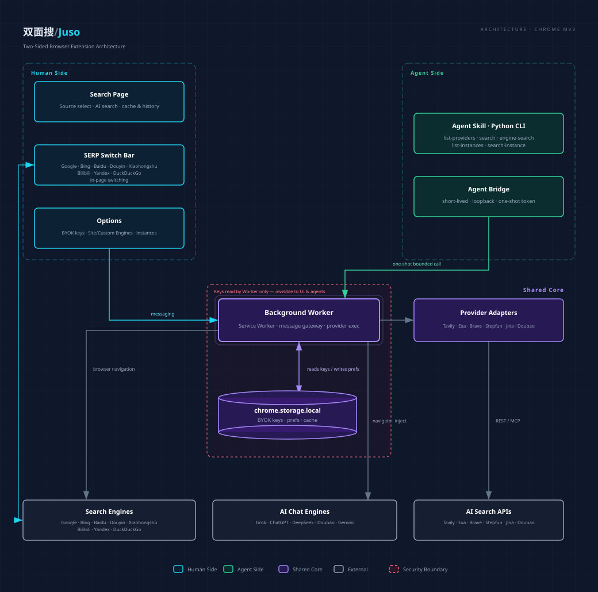

# Development and Building

This document is for developers who want to build, modify, or contribute to Juso from source.

## Install from Source

1. Clone the repository and install dependencies: `npm install`.
2. Build the production extension: `npm run build`.
3. Open `chrome://extensions` in Chromium, enable Developer mode, choose **Load unpacked**, and select `.output/chrome-mv3/`.

Developer-mode installation triggers browser warnings, and updates require manually rebuilding, replacing the loaded directory, and reloading the extension from the extensions page.

## Development Commands

```bash
npm install      # Install dependencies
npm run dev      # WXT development (HMR)
npm run build    # Production build → .output/chrome-mv3/
npm run build:dev    # Development build (with signing key, stable extension ID) → .output/chrome-mv3-dev/
npm run typecheck    # tsc --noEmit
npm test         # vitest run (unit + component tests)
npm run test:python  # Python skill tests (juso_bridge single source + skill CLI)
npm run test:mcp     # MCP server tests (pytest)
npm run gen-skills   # Regenerate published skill dirs + MCP vendor copy
npm run lint     # eslint .
```

## Development vs Production Build

| | `npm run build` | `npm run build:dev` |
|---|---|---|
| Purpose | Production release | Local development |
| Extension ID | No built-in key, assigned by browser (may vary) | Built-in public key, stable ID (`pdklefhommhabbhkglgkgomeibeibmcl`) |
| Chrome Web Store | Meets review requirements (no key) | Not suitable for publishing |

The development build (`build:dev`) uses a built-in public key to keep the extension ID stable, suitable for local debugging and agent skill integration. The corresponding agent skill is `skills/juso-search-dev/`.

## Architecture



- `entrypoints/search/`: independent human search page, source switching, cache, and history.
- `entrypoints/options/`: local credentials, Search Source preferences, and Site Engine / Custom Engine / Provider Instance management.
- `entrypoints/background.ts` and `lib/gateway.ts`: background service, message gateway, and bounded Agent Bridge actions.
- `lib/providers/`: adapters and normalized response model for Tavily, Exa, Brave, Stepfun pay-as-you-go, Step Plan, Jina, and Doubao (Custom/Global).
- `lib/provider-instances.ts`: multiple instances per provider (tuned-option variants); each instance is a first-class quick-switch target and holds no credentials. The gateway resolves `ProviderInstanceId → { providerId, options }` at the boundary.
- `lib/engines/`, `lib/ai-engines/`, `lib/site-engines.ts`, `lib/custom-engines.ts`: conventional search engines, AI chat engines (Grok/ChatGPT/DeepSeek/Doubao/Gemini, via injection or URL prefill), Site Engines (`site:`), and Custom Engines (`%s` URL templates).
- SERP Switch Bar and `lib/engine-search.ts`: result-page switch-bar injection and ordinary-result extraction, on an execution path distinct from API services.
- `lib/storage.ts`, `lib/config-io.ts`, `lib/schema.ts`: local configuration, source preferences, cache, config import/export, and schema migrations.
- `mcp-server/`: standalone pip package `juso-search` that exposes the Agent Bridge's 6 actions as MCP tools (stdio) for MCP-native clients (Claude Desktop / Cursor / Cline / Claude Code); shares the `juso_bridge` single-source module with the CLI skill (drift-locked).

## Tech Stack

WXT + React + TypeScript, Chrome MV3. WXT auto-imports `defineBackground`, `browser`, `defineContentScript`, and React hooks (no manual imports needed). Use `browser` (typed), not `chrome`.

## Security Constraints

API keys are BYOK, stored only in `chrome.storage.local`, read only by the background worker. Never commit keys; page code never reads stored plaintext keys, nor reads the `providerKeys` map; when configuration status is needed, return sanitized status via worker message (e.g., list of configured provider ids).

## Testing

Vitest + jsdom. Adapters mock `fetch` (REST) / MCP endpoints (stepfun-plan), storage uses in-memory `browser.storage.local`. Component tests mock `@/lib/messaging` and `@/lib/storage`.

Python tests (`npm run test:python`) cover the skill CLI and the `juso_bridge` single-source module; MCP server tests (`npm run test:mcp`, pytest) cover config parsing/exit codes, tool schema and wire fields, the dual-era handshake (real subprocesses), and stdout cleanliness.

## Further Reference

- `CONCEPTS.md` — project domain vocabulary (entities, naming flows, state concepts)
- `docs/solutions/` — recorded problem solutions
- `docs/plans/` — historical planning documents
