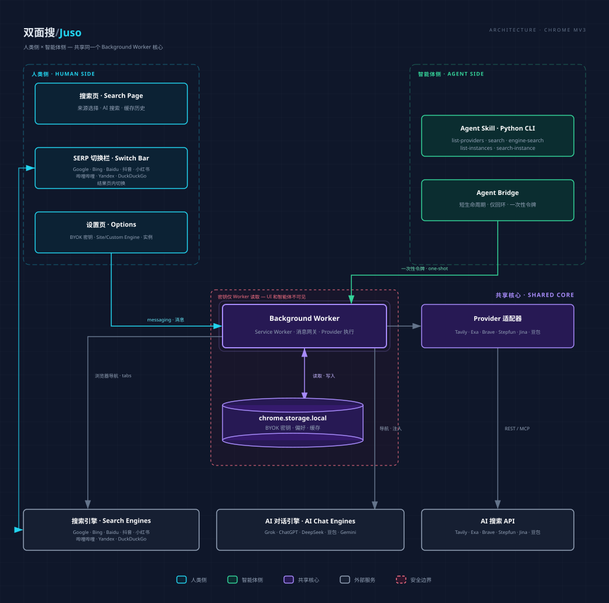

# 开发与构建

本文档面向希望从源码构建、修改或贡献 Juso 的开发者。

## 从源码安装

1. 克隆仓库并安装依赖：`npm install`。
2. 构建生产版本：`npm run build`。
3. 打开 Chromium 的 `chrome://extensions`，开启"开发者模式"，选择"加载已解压的扩展程序"，并选择 `.output/chrome-mv3/`。

开发者模式安装会显示浏览器警告，且更新需要手动重新构建、替换已加载目录，并在扩展管理页重新加载扩展。

## 开发命令

```bash
npm install      # 安装依赖
npm run dev      # WXT 开发（HMR）
npm run build    # 生产构建 → .output/chrome-mv3/
npm run build:dev    # 开发构建（含签名 key，扩展 ID 稳定）→ .output/chrome-mv3-dev/
npm run typecheck    # tsc --noEmit
npm test         # vitest run（单元 + 组件测试）
npm run test:python  # Python 技能测试（juso_bridge 单源 + skill CLI）
npm run test:mcp     # MCP server 测试（pytest）
npm run gen-skills   # 重新生成 skill 发布目录 + MCP vendor 副本
npm run lint     # eslint .
```

## 开发与生产构建的区别

| | `npm run build` | `npm run build:dev` |
|---|---|---|
| 用途 | 生产发布 | 本地开发 |
| 扩展 ID | 无内置 key，由浏览器分配（每次加载可能不同） | 含内置公钥，ID 稳定（`pdklefhommhabbhkglgkgomeibeibmcl`） |
| Chrome Web Store | 满足审核要求（不含 key） | 不适合发布 |

开发版（`build:dev`）使用内置公钥保持扩展 ID 稳定，适合本地调试和智能体技能对接。对应的智能体技能为 `skills/juso-search-dev/`。

## 架构



- `entrypoints/search/`：独立人类搜索页、搜索来源切换、缓存与历史。
- `entrypoints/options/`：本地密钥、来源偏好、Site Engine / Custom Engine / Provider Instance 管理。
- `entrypoints/background.ts`、`lib/gateway.ts`：后台服务、消息网关与 Agent Bridge 的受限执行入口。
- `lib/providers/`：Tavily、Exa、Brave、Stepfun 按量与 Step Plan、Jina、Doubao（Custom/Global）的适配器及统一响应模型。
- `lib/provider-instances.ts`：同一 provider 的多实例（调好参数的变体），实例是快切栏一等目标，不持有密钥；gateway 在边界解析 `ProviderInstanceId → { providerId, options }`。
- `lib/engines/`、`lib/ai-engines/`、`lib/site-engines.ts`、`lib/custom-engines.ts`：传统搜索引擎、AI 对话引擎（Grok/ChatGPT/DeepSeek/豆包/Gemini，注入或 URL 预填）、站外搜索（`site:`）、自定义引擎（`%s` URL 模板）。
- SERP Switch Bar 与 `lib/engine-search.ts`：结果页切换栏注入、普通结果提取；其执行契约不同于 API 服务。
- `lib/storage/`、`lib/config-io.ts`、`lib/schema.ts`：本地配置、来源偏好、缓存、配置导入导出与 schema 迁移。
- `mcp-server/`：独立 pip 包 `juso-search`，把 Agent Bridge 的 5 个 action 暴露为 MCP 工具（stdio），供 MCP 原生客户端（Claude Desktop / Cursor / Cline / Claude Code）调用；与 CLI skill 共享 `juso_bridge` 单源模块（drift 锁守卫）。

## 技术栈

WXT + React + TypeScript，Chrome MV3。WXT 自动导入 `defineBackground`、`browser`、`defineContentScript` 与 React hooks（无需手写 import）。使用 `browser`（已类型化），不要用 `chrome`。

## 安全约束

API key 为 BYOK，仅存 `chrome.storage.local`，仅由 background worker 读取。绝不提交 key；页面代码绝不读已存明文 key，也不读取 `providerKeys` map；需要配置状态时通过 worker message 返回脱敏状态（如已配置 provider id 列表）。

## 测试

Vitest + jsdom。适配器 mock `fetch`（REST）/ MCP 端点（stepfun-plan），storage 用内存版 `browser.storage.local`。组件测试 mock `@/lib/messaging` 与 `@/lib/storage`。

Python 测试（`npm run test:python`）覆盖 skill CLI 与 `juso_bridge` 单源模块；MCP server 测试（`npm run test:mcp`，pytest）覆盖配置解析/退出码、工具 schema 与 wire 字段、dual-era 握手（真实子进程）与 stdout 纯净性。

## 更多参考

- `CONCEPTS.md` — 项目领域词汇（实体、命名流程、状态概念）
- `docs/solutions/` — 已记录的问题解决方案
- `docs/plans/` — 历史计划文档
